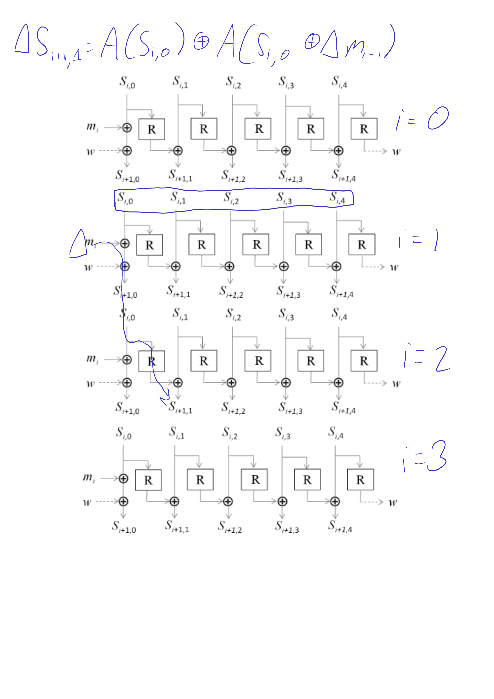
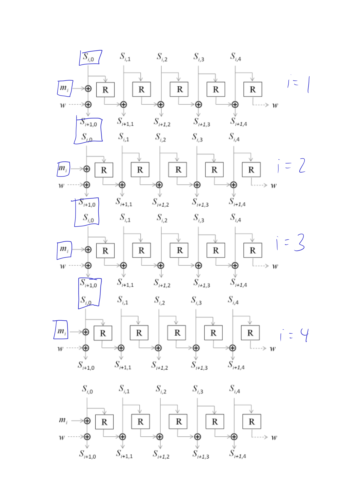
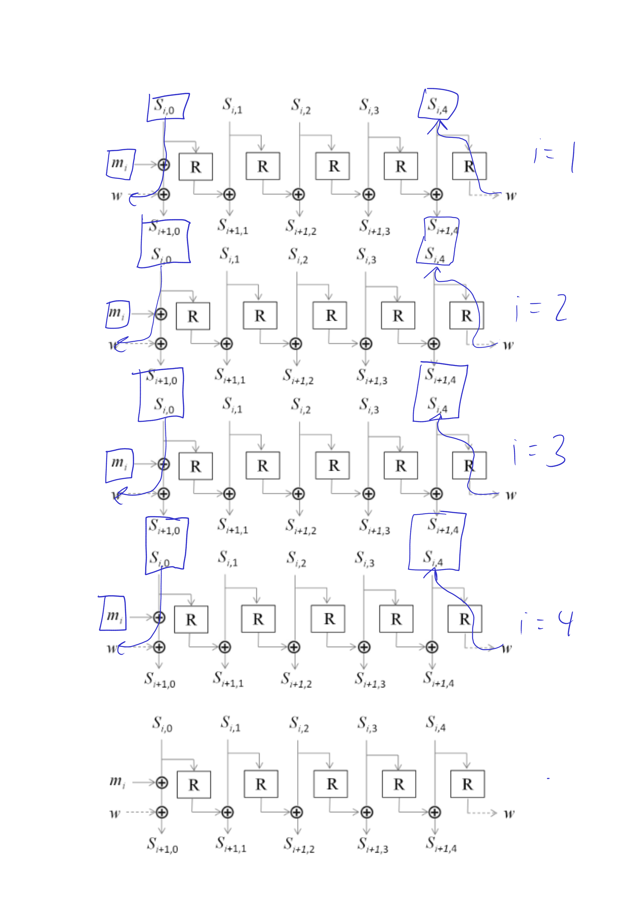
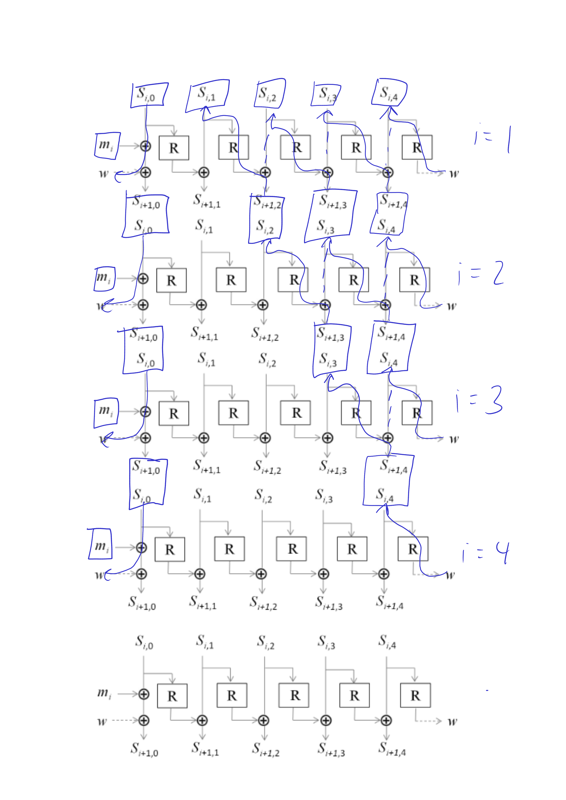
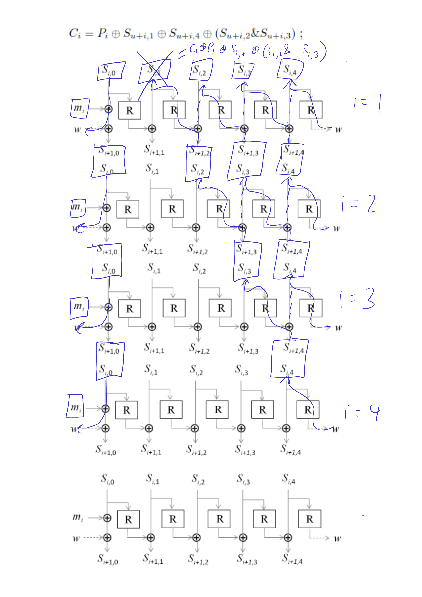
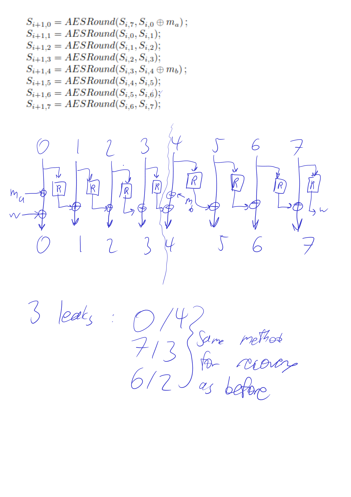

# oracle (crypto): 13 solves, 340 points

This challenge is separated into two parts, but is focused on the AEGIS
authenticated encryption algorithm.  The spec can be found [here](https://eprint.iacr.org/2013/695.pdf).

## Background: AEGIS

AEGIS is an authenticated encryption scheme that utilized the AES Round function heavily.
This round function maps 16-byte blocks to 16-byte blocks as follows.

```python
def aes_round(s: block) -> block:
	t0 = (te0[s[0]] ^ te1[s[5]] ^ te2[s[10]] ^ te3[s[15]])
	t1 = (te0[s[4]] ^ te1[s[9]] ^ te2[s[14]] ^ te3[s[3]])
	t2 = (te0[s[8]] ^ te1[s[13]] ^ te2[s[2]] ^ te3[s[7]])
	t3 = (te0[s[12]] ^ te1[s[1]] ^ te2[s[6]] ^ te3[s[11]])
	return struct.pack(">IIII", t0, t1, t2, t3)
```

With this function denoted as `R` (and `A` in some places in the notes I drew), we can describe
the relevant parts of AEGIS128 as the following sequence:
- Start with an initial state `S` of 5 16-byte blocks --- essentially random for our purposes
- For every block we encrypt
    - Generate a pad from the current state, namely `pad = S[1] ^ S[4] ^ (S[2] & S[3])`
    - Xor the pad with the plaintext block to get the ciphertext block
    - Run an update function on the block
- When done, generate a tag from the current state as well as the length of the plaintext
where this update function (with plaintext block `M`) is
```python
S = [S[0] ^ R(S[4]) ^ M, S[1] ^ R(S[0]), S[2] ^ R(S[1]), S[3] ^ R(S[2]), S[4] ^ R(S[3])]
```

For our first goal, I want to show how we can get at least _some_ part of the state
out of this, and to do that we must first analyze that `R` function.  Pretty clearly,
the whole crux of the opertation is the table lookups, which form the only nonlinear
part of the function.  We can isolate those out and rewrite that as:

```python
def aes_round_rearrange(s):
	mapping = [
		[ 0,  5, 10, 15],
		[ 4,  9, 14,  3],
		[ 8, 13,  2,  7],
		[12,  1,  6, 11]
	]
	return [tuple(s[m] for m in row) for row in mapping]

def aes_round_chunk(a, b, c, d):
	return te0[a] ^ te1[b] ^ te2[c] ^ te3[d]

def aes_round(s: block) -> block:
	return struct.pack(">IIII", *[aes_round_chunk(*x) for x in aes_round_rearrange(s)])
```

Now, considering the `R` function as the composition of a rearrangement and then
SBOXes, any property we find about the `aes_round_chunk` function we can use against
the full `R` function to our advantage.

To reverse it, I wrote a small brute-force C program
that finds the `a,b,c,d` inputs for a given output of the `aes_round_chunk` function.
To invert `R`, all we have to do is then split the block into the 4 resulting
chunks, run that program on each chunk, then remap the bits according to the inverse
of the mapping.  Since each chunk is only 32-bits long, the brute force is only 32-bits,
and can be done in a reasonable amount of time.

However, merely inverting this is not enough to find the state.  Outside of the `R` function,
most of the AEGIS cipher is linear, so let's apply some diffferential analysis.  Suppose we
xor the first block of the message with some known value and then run it again, what can we expect
to be different?  Well, the first block should just be different by that value since the state
and therefore the pad should be the same.  The second block won't be different since `S[0]` doesn't
matter to the pad.  The third block though will see a difference since that change has propagated to
`S[1]`, and I made a small (very scuffed) drawing to demonstrate what this difference is.  (I was
using `A` instead of `R` for some reason so they mean the same thing, sorry!)


The first effect on the `S[1]` block is that instead of being xored by the previous round's `R(S[0])`,
that `S[0]` now differs from the original by the difference in the message, and so what we see is that
`S[1] ^ S'[1] = R(S[0]) ^ R(S'[0])` where a tick denotes the value in the new run.
This difference will be seen in the message, so if we differed the first block of the message by `c`,
we should have (with `C` being the blocks of the ciphertext) that `C[2] ^ C'[2] = R(S[0]) ^ R(S[0] ^ c)`
with the `S[0]` being taken from after the first update (which happens to be the state we need to find
in the first part of the challenge).

This actually applies to differing any message block, as I drew for generic `i` in the following.



At this point, we have some characterizing feature of `S[0]`: namely that is has to satisfy that above
equation.  I wrote a similar function to how we inverted `R`, but this time to find all the `S[0]`s that
satisfy the equation when we know the left hand side and `c` (which we always should since the left hand
side is just from the outputs and `c` we chose).  It turns out in most cases that if we choose two different
`c`s, that there's only one possible `S[0]` that satisfies both.  Therefore, in two queries to an encryption
oracle we can leak the `S[0]` at any round.  Basically, if we leak 4 times using 8 queries
, our knowledge looks like the following:



Using the inversion of `R` to travel upwards, we can then use this to deduce more states, (this involves knowing
the `i=5` `S[0]` as well since we need to xor that to get the `i=4` `w`, so these diagrams are actually based on 5
leaks, sorry).



Continuing to the logical progression, we get



And now when drawing the diagrams I realized I made the mistake of needing one more leak, I crossed out
our `S[1]` leak.  However, it is not lost since we can still recover it from the other 4 states and
a single plaintext, ciphertext pair by how the pad is computed, as follows:



So, ideally if we need 2 queries for a single `S[0]` leak, we can leak the entire state of an AEGIS128 in
`2 * 4 + 1 = 9` queries (needing the extra one for the baseline against which to compare differentials).

## Part 1: state recovery against AEGIS128L

In part one, we're given 7 queries to an encryption oracle and get the ciphertext out,
using the same IV each time.  From this information, we must recover the full state of
the cipher.  However, unlike the above we aren't working with AEGIS128 just yet, we're
working with an alternate version of it that encrypts 2 16-byte blocks each time
and has a state of 8 blocks.  Luckily, the same ideas apply, and in fact reduce
the amount of queries we need by 2 since we can leak two `S[0]`s with each 2-query leak.

The paper doesn't have a great diagram for drawing this out, so I made my own bad one.



We can _kinda_ see that the squigly line I drew between 3 and 4 _almost_ separates
the cipher into two parts, but luckily the nature of our leaks means that we can
_basically_ treat this as a 2 4-state AEGIS128s.  First, leak the `S[0]` and `S[4]`s
of 3 rounds, which works great because the pad is essentially computed as if it were
2 distinct 4-state AEGIS128s.  Then, we can use the latter 2 leaks to go back to `S[7]`
and `S[3]` then `S[6]` and `S[2]`.  We can use the same trick as before to recover `S[1]`
and `S[5]` using a single plaintext-ciphertext pair.

This recovers the full state, and we're done with this part.

## Part 2: state recovery with a weird oracle against AEGIS128

In part 2, they're replaced the oracle with a decryption oracle and the cipher
with plain AEGIS128.  The oracle is also weird, in that insted of giving us
the decryption, we get the first `ascii` decoding error that it encounters.  Luckily
for us in Python that's very simple: we get the first byte of the output whose
highest bit is set and that byte's position if it exists.

The goal is just to leak `S[0]`s, and then use that information like before
to recover the state, from which we basically can do whatever we want with
the cipher.

First things first, we are given an initial ciphertext.  Since we need to
know the corresponding plaintext so that we have a baseline against which
to run differentials, we should leak that.  This is fairly simple: just
xor each byte of the ciphertext in turn with `0b10000000`, and then the
plaintext in that spot will have its high bit set since it's xored with
the same pad, and so the oracle will tell us what that plaintext bit is.

Once we have the plaintext, we have `231 - 96 = 135` queries left, and we have
to leak `80` bytes of a state.  Actually, we can leak 64 and then get `S[1]`
for free like before.  This means we have slightly more than 2 queries per
state byte leak.

Rather than differing each byte in the block like the last part, I'm going
to differ only one byte to isolate the influence on that byte on the differential.
Well, that one byte will correspond to one of the tables and to one of the
output 4-byte chunks, so therefore an error will be the first byte in that output
4-byte chunk that has its high bit set.  So, I made and ran a small program that
tries to find the differentials that distinguish the most possibilities for
the original bytes with as little oracle outputs as possible.  And, as expected
given the problem the expected number of oracle queries needed to distinguish
a single state byte was slightly more than 2.

After that, it was just a matter of leaking `S[0]` bytes through that message,
hoping we did enough, and then reconstructing the original state.  This solved
the challenge, with my team (PPP) being the sixth to solve this.

