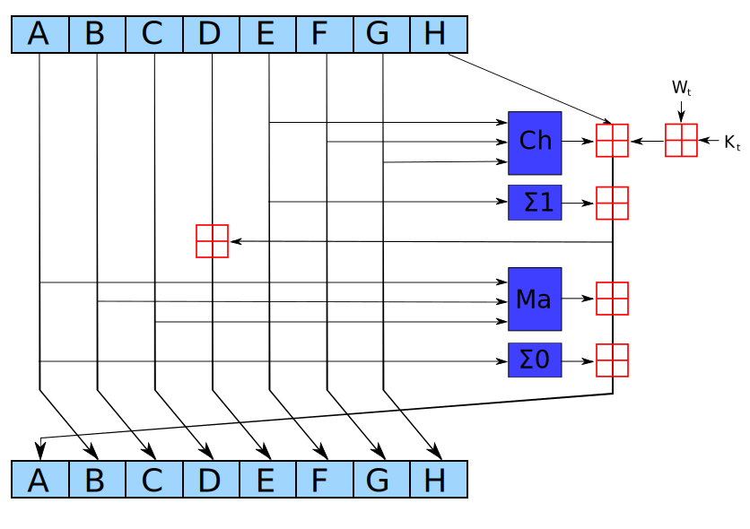

# SHArky (crypto): 38 solves, 231 points

In this challenge, you are given the SHA256 hash of a known value, except
the first 8 `k` values of the hash have been modified and you must
recover them.

We can quickly reimagine SHA2 as first getting some 64-chunk data from
some message, adding chunk-by-chunk to the ks, and then running an
accumulator 'compression' function one each resultant chunk in order.  Since
we only modified the first 8 ks, we can use our knowledge of the last 56
resultant chunks to roll-back the state of the hash until right after it
compressed the 8 unknown chunks, and our goal is to find those chunks knowing
the initial and end states.  For the future, I'll be refering to the 64-chunk
data as `W` and the the ks (or keys) as `K`.

The compression function looks like

and right now, if we imagine the states as 8-tuples before and after each round of
updating, we have the following information from knowing how the state starts and
ends:

| Round | a | b | c | d | e | f | g | h |
| ----- | --- | --- | --- | --- | --- | --- | --- | --- |
| 0     | x | x | x | x | x | x | x | x |
| 1     |   |   |   |   |   |   |   |   |
| 2     |   |   |   |   |   |   |   |   |
| 3     |   |   |   |   |   |   |   |   |
| 4     |   |   |   |   |   |   |   |   |
| 5     |   |   |   |   |   |   |   |   |
| 6     |   |   |   |   |   |   |   |   |
| 7     |   |   |   |   |   |   |   |   |
| 8     | x | x | x | x | x | x | x | x |

Now, just looking at the round function it is not hard to reverse if we know
the `K[i] + W[i]`, (which we used above), but if we don't notice the only
thing we can't figure out is the original `h`---the original a, b, c, e, f, g
being exactly one of the output and the original d being the output e with a function
of the original a, b, c (which we have).  Just propagating all information we have
backwards we get

| Round | a | b | c | d | e | f | g | h |
| ----- | --- | --- | --- | --- | --- | --- | --- | --- |
| 0     | x | x | x | x | x | x | x | x |
| 1     | x |   |   |   |   |   |   |   |
| 2     | x | x |   |   |   |   |   |   |
| 3     | x | x | x |   |   |   |   |   |
| 4     | x | x | x | x |   |   |   |   |
| 5     | x | x | x | x | x |   |   |   |
| 6     | x | x | x | x | x | x |   |   |
| 7     | x | x | x | x | x | x | x |   |
| 8     | x | x | x | x | x | x | x | x |

Now that we have the entire first initial information as well as the next round's
a, we can use our information about how the new a should be some function of the inputs
combined with the `K[i] + W[i]` to figure out the `K[0] + W[0]`.  We can then use this
information (as well as our knowledge of `W`) to determine `K[0]`.  From here, we can
just normally compute the entire round 1 information, getting us to

| Round | a | b | c | d | e | f | g | h |
| ----- | --- | --- | --- | --- | --- | --- | --- | --- |
| 0     | x | x | x | x | x | x | x | x |
| 1     | x | x | x | x | x | x | x | x |
| 2     | x | x |   |   |   |   |   |   |
| 3     | x | x | x |   |   |   |   |   |
| 4     | x | x | x | x |   |   |   |   |
| 5     | x | x | x | x | x |   |   |   |
| 6     | x | x | x | x | x | x |   |   |
| 7     | x | x | x | x | x | x | x |   |
| 8     | x | x | x | x | x | x | x | x |

And we can repeat this process to obtain every `K` we need to solve the problem and pop the flag.

