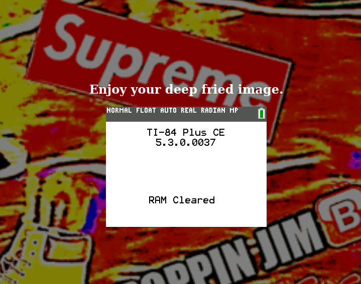
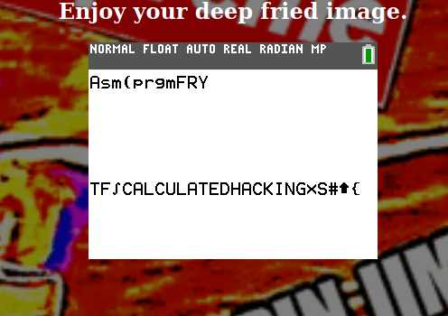

# UIUCTF2020: gen z math class (pwn, 1 solve, 500 points)

I played UIUCTF with Dice Gang last weekend.  We won.  Here's my writeup of one of
the more interesting challenges from the CTF: the pwn that had 1 solve at contest
end.

Upon first opening the challenge you are greeted with 3 files on a 'calculator',
a website that allows you to submit images, and source for those files
as well as how to build them.  These files are meant to be run using the [CEmu](https://ce-programming.github.io/CEmu/)
emulator.  So, combined with the challenge category we learn that we are going to be
pwning a Texas Instruments calculator.  Specifically, we're pwning a program on one
that was written in C.

## Getting started with CEmu and z80

The first important aspect to pwning these calculators is understanding the architecture.  That is,
we need to deal with z80. z80 is a RISC-y architecture from a long time ago designed for
(extremely) low-power systems---hence its appearance in the TI-84.  Some important notes are that
it doesn't support most common security mitigations (though the TI-84 loads nondeterministrically which
I'll discuss later), its 24-bit, and little endian.

CEmu itself is very, very nice to work with.  It has an integrated debugger, hex viewer, file loader,
save states, etc..., which made working with this architecture much easier.  (Though symbols
in the debugger were inconsistent at best).

Onto the actual problem.  Looking through the source, we see immediately a contrived section that looks
very vulnerable.  Namely, function pointers and `memcpy`.

```c
task_t* task_init() {
	...
	size = *(uint16_t*)archived_data; // we control archived_data
	raw_data = malloc(size); // so we control size

	task = malloc(sizeof(task_t));
	
	// raw_data is before task on the heap,
	// but task's function pointers are written to before raw_data.  this is very contrived
	
	task->filters.count = 2;
	task->filters.arr = default_filters; // a function pointer array

	memcpy(raw_data, archived_data, SIZE); // if size < SIZE, then we overwrite the function pointer array
	...
}
```


## About that controlled data...

The image format accepted by this is the TI calculator's own format, which was
reversed by some people and the results were used in other parts of the code. I
don't particularly care for the format though, since the first obstacle I ran into
was validation of the image file payload we were trying to run.  It seemed like
anything other than the standard files we recieved, even changing 1 bit of of the
image data, would lead us to not even get the image onto the calculator.

That was until I found an amazing [reference](http://merthsoft.com/linkguide/ti83+/fformat.html) about the
file format, which I quickly used to format my payloads in a way that would be accepted onto the
calculator.  All it took was copying the metadata from the known-valid files, and replacing the data,
checksum, and length fields with the right values---note that there's length field__s__.

## Debugging the exploit

Now that we could throw whatever we wanted into the `archived_data` variable in
the section above, we just had to figure how how to make it do what we wanted.  Like with
most pwn, the first goal was pc control.  Before that though, I wanted to check
that this was _actually_ the bug.  I quickly tested and sure enough, changing the
first 2 bytes of the data to something small (little endian) caused a calculator reset
and `RAM cleared` upon running the program we were supposed to pwn.  That length
field is actually not the same as other length fields within the file that was loaded
onto the calculator, so while we are allowed to make the image data short according
to the image itself, the data section of the image variable could be substantially longer,
so we did have the ability to control memory past `archived_data + size`.

As for debugging, in order to print out arbitrary memory before I had gotten used to
the CEmu interface, I would recompile the source of the program with the CEmu toolchain,
but adding in some writes to a debug variable, which I could view the hex data of
from the CEmu emulator.

With that, I could see specifically what was going where in memory, and this is
actually when I realized that the architecture has 24-bit everything: ints, uints, pointers, etc..
Therefore, if we want to bash out alignments we only need to try 3 things, which is nice.

My first idea was to send the pc to `quit`, which I did just by spamming quit's address wherever
I could.  Unfortunately, this lead to a crash, which I quickly fixed up by changing my
payload to the following

```
0100 // size = 1
(address of quit)
(address of the image segment in ROM) * N
```

As some explanation, TI calculators seem to load the contents of the image in the first slot
in a fairly consistent spot in ROM (yes, ROM according to CEmu).  So, this payload just
said that the array of function pointers started at the ROM segment that would contain the
address of quit.  Running this in CEmu, I got a clean exit.

## Shellcoding

Rather than learning z80, I just made a function called `win()` on my personal
version of the program that would call `PutScreenLine` (or the equivalent) on
a specific location in memory where I was pretty sure the flag loaded into.
I loaded up CEmu, copied over the hex from the function address into python, and boom shellcode.

The new payload was

```
0100 // size = 1 (0 doesn't work)
(address of shellcode)
(address of the image segment in the ROM) * N
(shellcode)
```

This was getting the flag, but was incredibly inconsistent due to where the flag
loaded into memory being nondeterministic.  However, I did find a place where some section
of the flag tended to load into, and so using that address in the shellcode worked much
better.

## Last fix

Running this against the server resulted in a crash, not the flag like I had hoped.



So, I checked my teammates to see if they could reproduce the crash, or if it
popped the flag fore them too.  One teammate (noopnoop) had the crash, and it
turns out that the place where the image data loads into ROM is very inconsistent:
in fact its more inconsistent than where the first malloc lands.  So, using the
strange consistency of the first malloc I just loaded the shellcode from the
heap rather than the image, and on the server...




